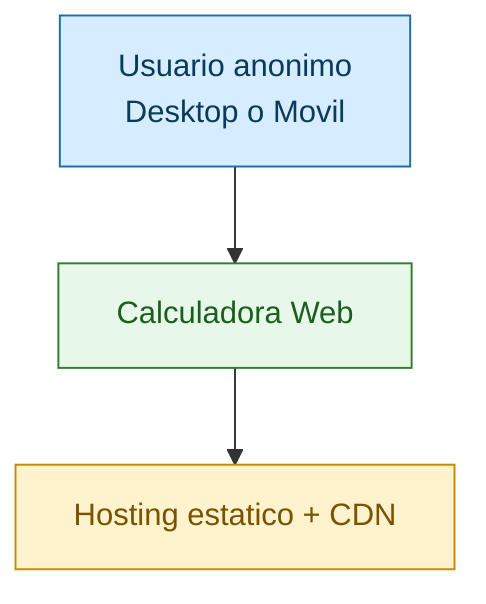
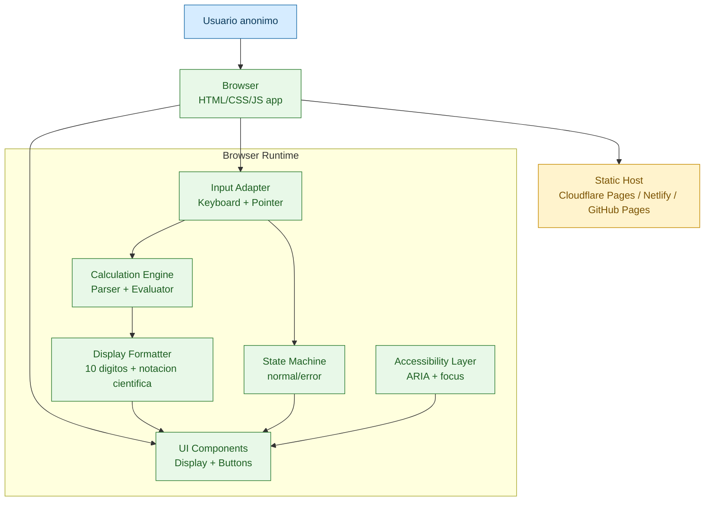
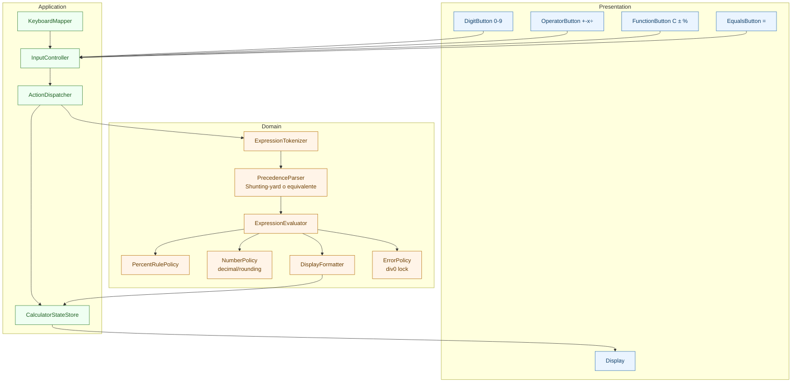
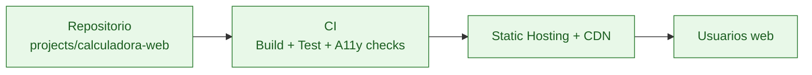

# Arquitectura Técnica: Calculadora Web Básica

**Módulo:** calculadora-web  
**Fuente PRD:** [docs/calculadora-web/requirements.md](requirements.md)  
**Fuente UI/UX:** [docs/calculadora-web/design.md](design.md)  
**Fuente Design System:** [docs/calculadora-web/design-system.md](design-system.md)  
**Estándares:** ISO/IEC/IEEE 42010:2011, ISO/IEC 25010:2011, C4 Model  
**Estado:** En revisión post-seguridad — T1/T2/T4/T5/T6 cerrados, T3 cerrado

## 1. Resumen Ejecutivo

Se propone una arquitectura **frontend-only** (sin backend), desplegada como sitio estático con CDN. Esta decisión alinea con NFR5/NFR6 (sin persistencia, sin datos personales) y simplifica cumplimiento de latencia percibida <100ms (NFR4).

Patrón general: **SPA mínima de una vista** con separación por capas internas:
- Presentación (componentes UI)
- Control de eventos (click/teclado)
- Motor de cálculo y parsing
- Gestión de estado de calculadora (normal/error)
- Formateo/validación de salida

## 2. Trazabilidad Requisitos a Decisiones

| Requisito | Decisión arquitectónica |
|---|---|
| FR1, FR3, FR7 | Motor de cálculo dedicado + parser de expresiones con precedencia estándar |
| FR2 | Adaptador de entrada unificado (teclado físico + pointer events) |
| FR4 | Soporte de decimal/signo en tokenizer + state machine |
| FR5 | Módulo `DisplayFormatter` con límite 10 dígitos y fallback científico |
| FR6 | Estado global `errorLocked` que bloquea todas las acciones excepto `C` |
| FR8, NFR2 | UI responsive mobile-first, grid fijo 4 columnas |
| NFR1 | Build targets para últimas 2 versiones de Chrome/Firefox/Edge/Safari |
| NFR3 | Capa de accesibilidad: ARIA, foco visible, navegación teclado |
| NFR4 | Ejecución local en cliente, operaciones O(n) sobre expresión corta |
| NFR5, NFR6 | Sin backend, sin cookies, sin localStorage, sin telemetría por defecto |

## 3. C4 - Nivel 1 (System Context)



**Interpretación:** usuario interactúa solo con frontend; no hay servicios de dominio ni base de datos.

## 4. C4 - Nivel 2 (Container)



## 5. C4 - Nivel 3 (Componentes del Frontend)



## 6. Stack Tecnológico (Opciones y Recomendación)

### Opción A (Recomendada)
- **Frontend:** React 18 + TypeScript (strict)
- **Bundler:** Vite
- **Styling:** CSS Modules + design tokens CSS custom properties
- **Testing:** Vitest (unit) + Playwright (e2e) + axe-core (a11y smoke)
- **Hosting:** Cloudflare Pages (o Netlify/GitHub Pages)

**Pros**
- Mapea directo a inventario UI por componentes
- Type safety para reglas de cálculo y estados de error
- Buen soporte de pruebas rápidas y accesibilidad

**Contras**
- Más tooling que una implementación vanilla

### Opción B
- **Frontend:** TypeScript vanilla + Web Components
- **Bundler:** Vite
- **Testing:** Vitest + Playwright

**Pros**
- Menor peso conceptual y runtime

**Contras**
- Mayor costo para manejo de estado/ergonomía de componentes complejos a futuro

## 7. Decisiones de Arquitectura (ADR)

## ADR-001: Frontend-only sin backend

**Status:** Proposed  
**Date:** 2026-08-06  
**Deciders:** Product Owner, Tech Lead, Architect

### Context
NFR5 exige sin persistencia; NFR6 sin recolección de datos personales; alcance excluye login/historial.

### Options Considered
1. **Frontend-only estático** - Pros: simple, costo bajo, latencia mínima. Cons: sin expansión directa a features de cuenta.
2. **Frontend + API mínima** - Pros: preparado para evolución. Cons: complejidad/costo innecesario para v1.

### Decision
Se propone **Frontend-only estático** para maximizar simplicidad y cumplir alcance v1.

### Consequences
- Positive: despliegue simple, menor superficie de ataque, costos bajos.
- Negative: futuras features de historial requerirán nueva arquitectura.
- Risks: variaciones de comportamiento entre motores JS si no se testea bien cross-browser.

### Approval
- [ ] Product Owner
- [ ] Tech Lead
- [ ] Security

## ADR-002: Parser con precedencia matemática explícita

**Status:** Proposed  
**Date:** 2026-08-06  
**Deciders:** Product Owner, Tech Lead, Architect

### Context
FR3 requiere precedencia matemática, no cálculo secuencial estilo calculadora simple.

### Options Considered
1. **Parser dedicado (Shunting-yard o equivalente)** - Pros: comportamiento determinista y testeable. Cons: más lógica inicial.
2. **Evaluación secuencial ad-hoc** - Pros: implementación rápida. Cons: viola FR3.

### Decision
Se propone parser dedicado por trazabilidad directa a FR3.

### Consequences
- Positive: exactitud en precedencia y mejor mantenibilidad.
- Negative: mayor complejidad inicial.
- Risks: bugs de parsing en edge cases; mitigar con suite RED de Test Engineer.

### Approval
- [ ] Product Owner
- [ ] Tech Lead

## ADR-003: Estrategia numérica para decimales

**Status:** Accepted  
**Date:** 2026-08-06  
**Deciders:** Product Owner, Tech Lead, Architect

### Context
Riesgo PRD: precisión IEEE-754 en casos como 0.1+0.2.

### Options Considered
1. **Aritmética decimal exacta (decimal.js)** - Pros: resultados predecibles. Cons: dependencia externa adicional.
2. **Number nativo + normalización de salida** - Pros: simple y rápido. Cons: posibles sorpresas numéricas.

### Decision
Se adopta **decimal.js** con política explícita de redondeo para asegurar resultados estables en display y pruebas.

Política de redondeo aprobada:
- Cálculo interno: precisión decimal completa de la librería.
- Display normal: máximo 10 dígitos significativos.
- Redondeo display: half-up a 10 dígitos significativos.
- Ceros de cola: se eliminan en display normal.
- Overflow de magnitud: notación científica (`m.mmme+N`) alineada con FR5.

### Consequences
- Positive: consistencia de resultados para usuario final y estabilidad de snapshots de test.
- Negative: pequeño aumento de bundle.
- Risks: dependencia externa adicional; mitigar con lockfile y auditoría en CI.

### Approval
- [x] Product Owner
- [x] Tech Lead

## ADR-004: Regla de porcentaje completa

**Status:** Accepted  
**Date:** 2026-08-06  
**Deciders:** Product Owner, Requirements Analyst, Architect

### Context
FR7 requería cerrar comportamiento completo de porcentaje para `+`, `-`, `×`, `÷` y standalone.

### Options Considered
1. **Modelo calculadora física completo** (reglas por operador y standalone).
2. **Soporte parcial** (solo `+` y `-`) y bloqueo en otros casos.

### Decision
Se adopta modelo de calculadora física completa:
- `200 + 10% = 220`
- `200 - 10% = 180`
- `200 × 10% = 20`
- `200 ÷ 10% = 2000`
- `10% = 0.1`

### Consequences
- Positive: reglas deterministas y testeables en todo operador.
- Negative: usuarios que esperen semántica distinta podrían confundirse inicialmente.
- Risks: mitigado con BDD y tooltips/labels de ayuda en UI si se requiere.

### Approval
- [x] Product Owner
- [x] Requirements Analyst

## 8. Arquitectura de Despliegue



**Estrategia propuesta**
- Build inmutable por commit/tag
- Cache-control agresivo para assets con hash
- `index.html` con cache corto para roll-forward rápido

### Baseline de headers de seguridad (T4)

Headers obligatorios en hosting estático:
- `Strict-Transport-Security: max-age=31536000; includeSubDomains; preload`
- `Content-Security-Policy: default-src 'self'; script-src 'self'; style-src 'self'; img-src 'self' data:; font-src 'self'; connect-src 'self'; object-src 'none'; base-uri 'self'; frame-ancestors 'none'; form-action 'self'`
- `X-Content-Type-Options: nosniff`
- `Referrer-Policy: no-referrer`
- `Permissions-Policy: geolocation=(), microphone=(), camera=(), payment=(), usb=()`
- `X-Frame-Options: DENY`

Notas de implementación:
- No usar scripts inline.
- No usar `unsafe-eval`.
- Habilitar redirección obligatoria HTTP -> HTTPS.

### Estrategia de caché (TM-11)

- Assets versionados por hash: `Cache-Control: public, max-age=31536000, immutable`
- `index.html`: `Cache-Control: no-cache, max-age=60, must-revalidate`
- Invalidación por release usando nuevo hash de assets.

## 9. Arquitectura de Seguridad

Sin autenticación por alcance, pero con hardening de frontend:
- CSP estricta: `default-src 'self'`; evitar inline scripts
- `X-Content-Type-Options: nosniff`
- `Referrer-Policy: no-referrer`
- `Permissions-Policy`: deshabilitar capacidades no usadas
- Dependencias bloqueadas con lockfile y escaneo SCA en CI
- Sin cookies/localStorage/sessionStorage para datos de usuario

Riesgo residual principal: supply-chain del frontend; mitigar con actualización periódica y revisión de advisories.

### Gates de integridad CI/CD (T5)

Pipeline mínimo obligatorio:
1. Verificar lockfile presente y sin drift (`npm ci` en modo limpio).
2. Auditoría de dependencias con severidad alta/crítica bloqueante.
3. Lint de seguridad frontend (prohibir `eval`, `new Function`, inline script patterns).
4. Build reproducible (mismo commit -> mismos artefactos hash).
5. Publicación inmutable por SHA de commit.
6. Protección de rama principal (reviews obligatorios, no force-push, checks requeridos).
7. Firma de release/tag y traza de procedencia de artefacto.

## 10. Arquitectura de Datos

- **Modelo:** estado efímero en memoria del navegador
- **Persistencia:** ninguna (alineado NFR5)
- **Entidades lógicas:**
  - `expressionBuffer`
  - `lastOperator`
  - `errorLocked`
  - `displayValue`
  - `pendingPercentContext`

### Límites anti-abuso de entrada y parser (T6)

Límites definidos:
- Longitud máxima de expresión visible: 64 caracteres.
- Máximo de tokens por evaluación: 64.
- Máximo de operadores consecutivos válidos: 1 (excepto signo unario).
- Rechazo de teclas no mapeadas sin mutación de estado.
- Rate limit de key repeat: procesar 1 evento cada 16ms por frame.

Comportamiento al exceder límites:
- Entrar a estado `Error` controlado.
- Solo `C` restablece estado (alineado FR6).

## 11. Especificación de API/Contratos

No hay API de red en v1. Se definen contratos internos para desacoplar componentes:

- `dispatchInput(action: CalculatorAction): void`
- `evaluateExpression(tokens: Token[]): EvalResult`
- `formatDisplay(value: DecimalLike, mode: DisplayMode): string`
- `applyPercent(context: PercentContext): DecimalLike`

Contratos endurecidos (T3 parcial):

- `NumberPolicy`
  - `normalizeInput(input: string): DecimalLike | ParseError`
  - `roundForDisplay(value: DecimalLike): string`
  - `toScientific(value: DecimalLike): string`

- `PercentRulePolicy`
  - `apply(baseValue: DecimalLike, operandValue: DecimalLike, operator: '+' | '-' | '*' | '/'): DecimalLike`
  - Reglas aceptadas:
    - `+`: `base + (base * operand/100)`
    - `-`: `base - (base * operand/100)`
    - `*`: `base * (operand/100)`
    - `/`: `base / (operand/100)`
    - standalone: `operand/100`

- `InputGuardPolicy`
  - `validateTokenCount(count: number): GuardResult`
  - `validateExpressionLength(length: number): GuardResult`
  - `shouldAcceptKey(tsNowMs: number, tsLastMs: number): boolean`

Estos contratos se implementan en `projects/calculadora-web/src/domain/**` y `projects/calculadora-web/src/app/**`.

## 12. Integraciones Externas

- Ninguna obligatoria para v1
- Opcional futuro: analytics privacy-first solo con aprobación explícita PO + Security

## 13. Estructura Objetivo de Proyecto

```text
projects/calculadora-web/
  src/
    app/
    domain/
    ui/
    styles/
  tests/
    unit/
    integration/
    e2e/
  package.json
  vite.config.ts
  tsconfig.json
```

## 14. Riesgos Técnicos y Mitigación

| Riesgo | Severidad | Mitigación |
|---|---|---|
| Ambigüedad de `%` fuera de suma | Alta | Cerrar ADR-004 antes de implementación |
| Diferencias de precisión decimal | Media | Aceptar ADR-003 (decimal.js) + tests de regresión |
| Cumplimiento WCAG incompleto en interacción teclado | Media | Tests e2e + axe-core + revisión manual de foco |
| Variación entre navegadores | Media | Matriz cross-browser en CI y pruebas manuales mínimas |

## 15. Decisiones que requieren aprobación humana

1. **Selección de stack:** Opción A (React+TS) vs Opción B (TS+Web Components)
2. **Estrategia de números decimales:** Cerrada (ADR-003 Accepted: `decimal.js` + rounding policy)
3. **Regla funcional completa de `%`**: Cerrada (ADR-004 Accepted: calculadora física completa)
4. **Proveedor de hosting estático** (Cloudflare Pages / Netlify / GitHub Pages)

## 16. Checkpoint de Handoff

**Pregunta de control:** ¿Esta arquitectura alinea con tus expectativas para pasar a `@product-breakdown-planner`?
