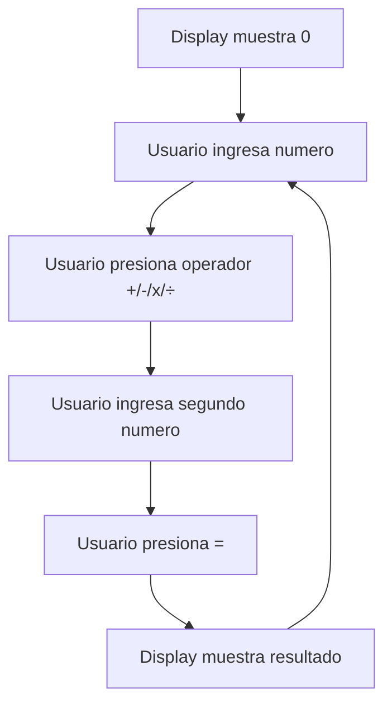
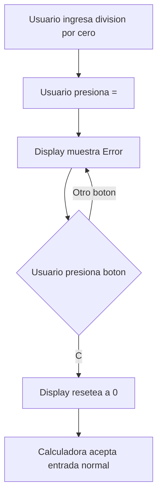
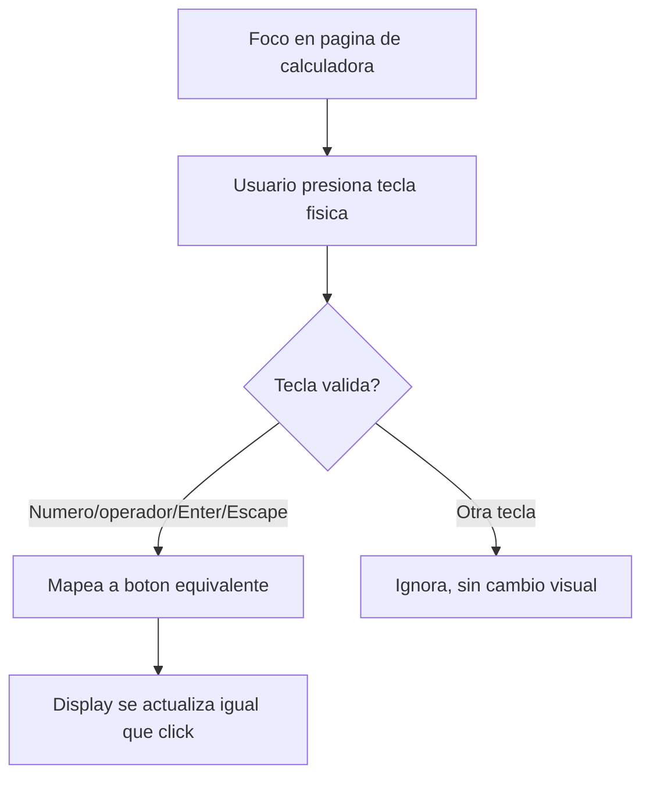

# UI/UX Design: Calculadora Web Básica

**Fuente:** [docs/calculadora-web/requirements.md](requirements.md)
**Estándares:** ISO 9241-210:2019, WCAG 2.1 AA, Nielsen Norman Heuristics
**Estado:** Borrador — pendiente aprobación

## Overview
- **Usuarios objetivo:** Usuario anónimo, sin cuenta (único actor)
- **Objetivo primario:** Calcular operaciones aritméticas básicas rápido, sin fricción
- **Plataformas:** Web responsive — escritorio y móvil (NFR2)

## Nota de dependencia abierta
PRD tiene pregunta pendiente sobre comportamiento de `%` en `-`, `×`, `÷` y uso standalone (fuera de alcance de este diseño — es lógica de negocio, no de interfaz). No bloquea layout/interacciones; el botón `%` existe visualmente igual sin importar la regla matemática final. Recomendado resolver con Requirements Analyst antes de pasar a Architect.

---

## Information Architecture

Aplicación de **una sola pantalla** (single-view). No requiere navegación, menús ni rutas.

### Sitemap
- `/` — Calculadora (única vista)

No hay jerarquía de contenido adicional: todo el estado vive en el display + teclado numérico.

---

## User Flows

### Flow 1: Cálculo básico (happy path)


### Flow 2: Error y recuperación (error path)


### Flow 3: Entrada por teclado físico (edge case)


---

## Wireframes

### Escritorio (>1024px)
```
┌───────────────────────────────────┐
│                                   │
│                        1,234.56  │  ← Display (right-aligned, monospace)
│                                   │
├───────────────────────────────────┤
│   C      ±       %       ÷       │
│   7      8       9       ×       │
│   4      5       6       −       │
│   1      2       3       +       │
│       0        .        =        │
└───────────────────────────────────┘
      Ancho fijo max 360px, centrado
```

### Móvil (<768px)
```
┌─────────────────────┐
│                     │
│          1,234.56  │  ← Display, mismo layout, full-width
│                     │
├─────────────────────┤
│  C    ±    %    ÷   │
│  7    8    9    ×   │
│  4    5    6    −   │
│  1    2    3    +   │
│    0      .    =    │
└─────────────────────┘
   Full-width, botones min 44x44px
```

**Nota:** mismo layout de grid 4 columnas en ambos breakpoints — solo cambia ancho del contenedor y tamaño de tipografía. Justifica consistencia: usuarios de calculadora esperan posición fija de botones (memoria muscular).

---

## Component Inventory

| Componente | Descripción | Estados |
|---|---|---|
| `Display` | Región de solo lectura, muestra valor actual/resultado/error | normal, error (texto rojo) |
| `DigitButton` (0-9) | Ingresa dígito | default, hover, pressed, focus-visible |
| `OperatorButton` (+, −, ×, ÷) | Selecciona operación | default, hover, pressed, focus-visible, active (resaltado mientras espera 2do operando) |
| `FunctionButton` (`C`, `±`, `%`) | Acciones especiales | default, hover, pressed, focus-visible |
| `EqualsButton` (`=`) | Ejecuta cálculo | default, hover, pressed, focus-visible |

### Justificación de agrupación visual
- Fila superior (`C`, `±`, `%`, `÷`) agrupa funciones + primer operador — sigue convención estándar de calculadora física (reduce carga cognitiva, usuarios ya conocen el patrón).
- Dígitos en bloque 3×3 + `0` ancho doble — estándar universal de teclado numérico.

---

## Interaction Patterns

### Click/Tap en botón
1. Botón muestra estado `pressed` (feedback visual inmediato, <100ms — NFR4)
2. Display se actualiza síncronamente
3. Sin loading spinner (operación es instantánea, cliente-side)

### Teclado físico (FR2)
| Tecla física | Acción equivalente |
|---|---|
| `0-9` | Dígito correspondiente |
| `+` `-` `*` `/` | Operador correspondiente |
| `.` | Decimal |
| `Enter` o `=` | Ejecuta cálculo (`=`) |
| `Escape` o `c`/`C` | Limpia (`C`) |
| Tecla no mapeada | Ignorada, sin cambio visual ni sonoro |

### Estado de error (FR6)
1. Display cambia texto a `"Error"`, color rojo (`--color-danger`)
2. Todos los botones excepto `C` quedan visualmente **inactivos** (opacidad reducida, `aria-disabled="true"`) — refuerza que solo `C` responde
3. Al presionar `C`: transición inmediata a `0`, botones recuperan estado activo

### Overflow de dígitos (FR5)
- Display reduce tamaño de fuente en 2 pasos (`clamp()`) antes de recurrir a notación científica, para maximizar dígitos legibles sin romper layout

---

## Responsive Design

### Breakpoints
- **Móvil:** `<768px` — contenedor full-width, padding lateral 16px
- **Tablet/Escritorio:** `≥768px` — contenedor centrado, ancho máximo 360px

### Estrategia
- Mobile-first
- Grid de botones: `display: grid; grid-template-columns: repeat(4, 1fr)` fijo en ambos breakpoints
- Touch targets: mínimo 44×44px (Apple HIG / WCAG 2.5.5)
- Tipografía de display escala con `clamp()` entre viewport móvil y escritorio

---

## Accessibility (WCAG 2.1 AA)

### Contraste
- Texto display normal: mínimo 4.5:1 sobre fondo
- Texto display error (rojo): mínimo 4.5:1 — validar `--color-danger` contra `--color-background`
- Botones: borde/relleno mínimo 3:1 contra fondo

### Navegación por teclado
- Orden de tab: `C → ± → % → ÷ → 7 → 8 → 9 → × → 4 → 5 → 6 − → 1 → 2 → 3 → + → 0 → . → =`
- Indicador de foco visible: outline 2px alto contraste en todo elemento interactivo
- Atajos de teclado físico (tabla arriba) no reemplazan tab navigation — ambos coexisten

### Screen readers
- `Display` usa `aria-live="polite"` — anuncia cambios de valor y errores sin interrumpir
- Cada botón tiene `aria-label` explícito (ej. botón `×` → `aria-label="Multiplicar"`, no solo el símbolo)
- Estado de error: `role="alert"` en el momento que aparece `"Error"` (interrupción necesaria, distinto de updates normales)

### Manejo de foco
- Al cargar la página, foco inicial no forzado (usuario decide con tab o click)
- Ningún modal en esta feature — no aplica gestión de foco de overlay

---

## Approval
- [ ] Product Owner: diseño alinea con expectativa de "calculadora simple, sin fricción"
- [ ] Accesibilidad: WCAG 2.1 AA cubierto
- [ ] Feasible para Architect/Frontend implementar sin stack específico aún definido
