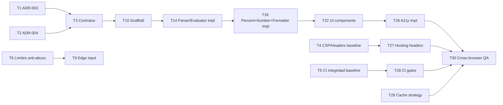

# Plan WBS: Calculadora Web Básica

Fuentes:
- `docs/calculadora-web/requirements.md`
- `docs/calculadora-web/design.md`
- `docs/calculadora-web/architecture.md`
- `docs/calculadora-web/threat-model.md`

Estado: Propuesto para ejecución  
Fecha: 2026-08-06

## 1. Supuestos y alcance operativo

- Threat model aprobado por Product Owner.
- Proyecto objetivo de implementación: `projects/calculadora-web/`.
- Estrategia TDD obligatoria: primero tests RED, luego implementación.
- Duración máxima por tarea: <= 2 días.

## 2. Estructura WBS

## Epic E1 - Riesgo y seguridad primero (Sprint 0)

### Feature F1 - Cierre de decisiones de arquitectura bloqueantes

#### Enabler EN1 - Cerrar ADR críticos (TM-08, TM-09)

- **Task T1 (0.5 d, 2h, 1 SP) - Definir política decimal (ADR-003) (WHAT/WHY/DONE)**
  - WHAT: seleccionar `decimal.js` o `Number` nativo con política de redondeo explícita.
  - WHY: eliminar riesgo TM-08 por deriva de precisión.
  - DONE: decisión registrada en arquitectura, ejemplo `0.1+0.2` esperado definido.
  - DoR: criterios de precisión definidos, owner disponible, alcance acotado.
  - DoD: ADR actualizado, escenarios BDD de precisión trazados.

- **Task T2 (0.5 d, 2h, 1 SP) - Cerrar semántica `%` completa (ADR-004) (WHAT/WHY/DONE)**
  - WHAT: definir comportamiento para `+`, `-`, `×`, `÷`, standalone.
  - WHY: eliminar ambigüedad de negocio (TM-09).
  - DONE: tabla de reglas aprobada por Product Owner y Requirements.
  - DoR: escenarios ambiguos identificados, decisores disponibles.
  - DoD: reglas agregadas a PRD/arquitectura y listas para test.

- **Task T3 (1 d, 6h, 2 SP) - Propagar decisiones ADR a contratos internos (WHAT/WHY/DONE)**
  - WHAT: actualizar contratos de `PercentRulePolicy` y `NumberPolicy` en documento de arquitectura.
  - WHY: evitar implementación divergente entre equipos.
  - DONE: contratos internos y ejemplos actualizados en arquitectura.
  - DoR: T1 y T2 completados.
  - DoD: arquitectura consistente con PRD y threat model.

### Feature F2 - Controles de seguridad de plataforma y pipeline

#### Enabler EN2 - Hardening de entrega y cadena de suministro

- **Task T4 (1 d, 6h, 2 SP) - Definir baseline de headers y CSP (TM-01, TM-07) (WHAT/WHY/DONE)**
  - WHAT: especificar CSP, HSTS, nosniff, referrer-policy, permissions-policy.
  - WHY: reducir spoofing y ejecución de scripts no confiables.
  - DONE: política documentada para hosting estático.
  - DoR: arquitectura de despliegue definida.
  - DoD: checklist de headers listo para verificación en CI.

- **Task T5 (1 d, 6h, 2 SP) - Diseñar controles CI de integridad (TM-02, TM-11) (WHAT/WHY/DONE)**
  - WHAT: branch protection, artefactos inmutables, lockfile obligatorio, auditoría dependencias.
  - WHY: bloquear tampering en pipeline y mezcla de assets.
  - DONE: gates definidos en pipeline objetivo.
  - DoR: estrategia de despliegue aprobada.
  - DoD: criterios de paso/fallo CI documentados.

- **Task T6 (0.5 d, 3h, 1 SP) - Definir límites anti-abuso parser/input (TM-06, TM-12) (WHAT/WHY/DONE)**
  - WHAT: máximo de longitud de entrada, máximo tokens y rate limit de teclas repetidas.
  - WHY: evitar congelamiento de UI y degradación por flood.
  - DONE: límites numéricos acordados y trazados a tests.
  - DoR: engine de cálculo identificado.
  - DoD: valores límite incluidos en estrategia de pruebas.

## Epic E2 - Núcleo funcional de calculadora (Sprint 1)

### Feature F3 - Base de proyecto y estado de aplicación

#### Story S1 - Scaffold frontend + estado base

- **Task T7-UT (0.5 d, 3h, 1 SP) - Unit tests RED para reducer de estado**
  - WHAT: tests de transiciones `idle`, `input`, `errorLocked`, `clear`.
  - WHY: prevenir regresiones de estado.
  - DONE: suite RED falla por falta de implementación.
  - DoR: modelo de estado definido en arquitectura.
  - DoD: tests ejecutan y fallan por causa esperada.

- **Task T8-IT (0.5 d, 3h, 1 SP) - Integration tests RED input-controller + state store**
  - WHAT: validar mapeo evento->acción->estado.
  - WHY: asegurar integración click/teclado.
  - DONE: pruebas RED cubren flujo básico y bloqueo por error.
  - DoR: contratos internos publicados.
  - DoD: integración falla de forma determinista antes de implementar.

- **Task T9-ET (0.5 d, 3h, 1 SP) - Edge tests RED para input inválido/flood**
  - WHAT: teclas no soportadas, ráfaga de keydown, buffers límite.
  - WHY: cubrir TM-06/TM-12.
  - DONE: casos edge documentados y en suite.
  - DoR: límites de T6 definidos.
  - DoD: edge cases reproducibles en test.

- **Task T10 (1.5 d, 9h, 3 SP) - Implementar scaffold en `projects/calculadora-web/src/app`**
  - WHAT: bootstrap Vite/TS, store, dispatcher, wiring de eventos.
  - WHY: base para features de dominio/UI.
  - DONE: tests T7-T9 pasan en verde.
  - DoR: T7/T8/T9 en RED.
  - DoD: implementación cumple lint/build y pasa suite correspondiente.

### Feature F4 - Motor de cálculo con precedencia

#### Story S2 - Parser + evaluator

- **Task T11-UT (1 d, 6h, 2 SP) - Unit tests RED parser precedencia (FR3)**
- **Task T12-IT (0.5 d, 3h, 1 SP) - Integration tests RED tokenizer->parser->evaluator**
- **Task T13-ET (0.5 d, 3h, 1 SP) - Edge tests RED paréntesis implícitos no soportados/errores sintaxis**
- **Task T14 (1.5 d, 9h, 3 SP) - Implementar `ExpressionTokenizer`, `PrecedenceParser`, `ExpressionEvaluator` en `projects/calculadora-web/src/domain`**

Criterio WHAT/WHY/DONE (aplica T11-T14):
- WHAT: cubrir operaciones +, -, ×, ÷ con precedencia correcta.
- WHY: cumplir FR1/FR3 con comportamiento determinista.
- DONE: `2+3×4=14` y demás escenarios BDD en verde.

DoR S2: S1 completada, contratos de dominio definidos.  
DoD S2: tests unit/integration/edge verdes y cobertura de precedencia >=90% módulo parser.

### Feature F5 - Reglas de porcentaje, decimal y formatter

#### Story S3 - PercentRule + NumberPolicy + DisplayFormatter

- **Task T15-UT (1 d, 6h, 2 SP) - Unit tests RED para reglas `%`, redondeo y notación científica**
- **Task T16-IT (0.5 d, 3h, 1 SP) - Integration tests RED evaluator+formatter+state**
- **Task T17-ET (0.5 d, 3h, 1 SP) - Edge tests RED overflow 10 dígitos/división por cero**
- **Task T18 (1.5 d, 9h, 3 SP) - Implementar `PercentRulePolicy`, `NumberPolicy`, `DisplayFormatter` en `projects/calculadora-web/src/domain`**

Criterio WHAT/WHY/DONE (aplica T15-T18):
- WHAT: aplicar regla `%` aprobada, precisión decimal elegida, fallback científico.
- WHY: cumplir FR4/FR5/FR6/FR7.
- DONE: escenarios BDD de porcentaje, error y overflow en verde.

DoR S3: T1/T2/T3 cerradas.  
DoD S3: porcentaje sin ambigüedad y precisión estable documentada y probada.

## Epic E3 - UI, accesibilidad y release (Sprint 2)

### Feature F6 - Componentes UI y responsive

#### Story S4 - Implementar componentes y layout

- **Task T19-UT (0.5 d, 3h, 1 SP) - Unit tests RED de render/estados botones y display**
- **Task T20-IT (0.5 d, 3h, 1 SP) - Integration tests RED flujo click completo hasta display**
- **Task T21-ET (0.5 d, 3h, 1 SP) - Edge tests RED viewport móvil 375px sin scroll horizontal**
- **Task T22 (1.5 d, 9h, 3 SP) - Implementar `Display`, `DigitButton`, `OperatorButton`, `FunctionButton`, `EqualsButton` + estilos en `projects/calculadora-web/src/ui` y `projects/calculadora-web/src/styles`**

WHAT/WHY/DONE:
- WHAT: construir UI definida por diseño.
- WHY: cumplir FR8 y consistencia de interacción.
- DONE: flujos happy path click/tap operativos en desktop y móvil.

DoR S4: S1-S3 completas.  
DoD S4: responsive validado en breakpoints definidos.

### Feature F7 - Accesibilidad y teclado

#### Story S5 - Cumplimiento WCAG 2.1 AA

- **Task T23-UT (0.5 d, 3h, 1 SP) - Unit tests RED para atributos ARIA y focus-visible**
- **Task T24-IT (0.5 d, 3h, 1 SP) - Integration tests RED para keymap y navegación por tab**
- **Task T25-ET (0.5 d, 3h, 1 SP) - Edge tests RED para `aria-live`/`role=alert` en error**
- **Task T26 (1 d, 6h, 2 SP) - Implementar capa A11y en `projects/calculadora-web/src/ui` + ajustes de interacción teclado en `projects/calculadora-web/src/app`**

WHAT/WHY/DONE:
- WHAT: labels, foco visible, live regions, role alert, key mapping completo.
- WHY: cumplir NFR3 y reducir riesgo TM-10.
- DONE: pruebas axe-core sin violaciones críticas/serias.

DoR S5: componentes UI listos.  
DoD S5: checklist WCAG objetivo en verde.

### Feature F8 - Seguridad final de entrega y QA cross-browser

#### Enabler EN3 - Release hardening

- **Task T27 (0.5 d, 3h, 1 SP) - Configurar headers/CSP en hosting estático**
- **Task T28 (1 d, 6h, 2 SP) - Configurar CI gates seguridad: audit dependencias, lockfile, build reproducible**
- **Task T29 (0.5 d, 3h, 1 SP) - Configurar caché hash assets + index corto**
- **Task T30 (1 d, 6h, 2 SP) - Ejecutar matriz pruebas cross-browser (NFR1) + remediaciones menores**

WHAT/WHY/DONE:
- WHAT: cerrar controles TM-01/TM-02/TM-07/TM-11.
- WHY: evitar riesgo alto en despliegue.
- DONE: evidencia de pipeline verde y reporte de compatibilidad.

DoR EN3: features funcionales y A11y completadas.  
DoD EN3: pipeline release cumple seguridad y compatibilidad.

## 3. Dependencias (grafo)

## 4. Ruta crítica

Ruta crítica propuesta:
1. T1
2. T2
3. T3
4. T10
5. T14
6. T18
7. T22
8. T26
9. T30

Duración estimada ruta crítica: ~10.5 días hábiles efectivos.

## 5. Estimación total y capacidad por sprint

- Sprint 0 (riesgo/seguridad): T1-T6 = 8 SP
- Sprint 1 (núcleo cálculo): T7-T18 = 19 SP
- Sprint 2 (UI/A11y/release): T19-T30 = 18 SP

Total estimado: 45 SP

## 6. Asignación sugerida por rol

- Requirements Analyst: T2 (cierre regla `%`)
- Software Architect: T1, T3, T4, T5, T6
- Test Engineer: tareas `*-UT`, `*-IT`, `*-ET`
- Frontend Developer: T10, T14, T18, T22, T26
- Tech Lead/DevOps: T27, T28, T29, T30
- Security Engineer: validación controles T4/T5/T27/T28

## 7. Gates DoR/DoD por historia/enabler

Checklist DoR mínimo (aplica a cada Story/Enabler antes de iniciar):
- [ ] Dependencias previas completadas
- [ ] Criterio de aceptación BDD mapeado a tests
- [ ] Riesgos de seguridad identificados con owner
- [ ] Estimación <= 2 días por tarea
- [ ] Ruta en `projects/calculadora-web/src|tests` definida

Checklist DoD mínimo (aplica a cada Story/Enabler al cerrar):
- [ ] Tests Unit/Integration/Edge en verde
- [ ] Cobertura acordada alcanzada en módulo objetivo
- [ ] Controles de seguridad asociados implementados/verificados
- [ ] Sin bloqueadores abiertos en PRD/arquitectura/threat model
- [ ] Evidencia de ejecución CI adjunta

## 8. Bloqueadores actuales

- Si ADR-003 no se aprueba, S3 queda bloqueada.
- Si ADR-004 no se aprueba, reglas `%` y tests asociados quedan bloqueados.

## 9. Checkpoint humano para aprobación

Pregunta de control: ¿este breakdown de tareas y secuencia Sprint 0-1-2 te parece realista para ejecutar?